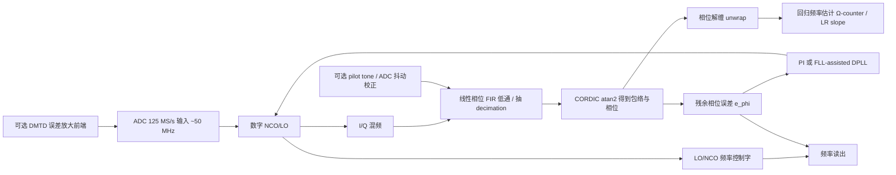

# FPGA 上基于 DPLL 与数字鉴相的高精度频率测量深度研究报告

## 执行摘要

对于 **125 MS/s ADC、被测信号约 50 MHz** 的系统，如果目标是显著超过“比较器整形 + 精密计数器”的传统实现，并尽量逼近商用高端频率计/相位计，那么**最值得优先投入**的路线不是单纯把一个数字 PLL “锁上去”，而是把三类思想合并：**窄带数字下变频 phasemeter、连续时间戳/回归式频率估计、以及必要时的误差放大或时间插值**。商业频率计之所以强，并不只是“时基更好”，更关键的是它们在前端触发、时间插值、连续无死区采样、时间戳回归和统计分析方面做了整套优化；例如 Keysight 53230A 给出 **12 digits/s** 频率分辨率与 **20 ps** 单次时间分辨率，Pendulum CNT-104S 给出 **12–13 digits/s** 与 **<7 ps** 时间戳分辨率，并强调 **gap-free / continuous timestamping**。citeturn11search0turn11search1turn11search2turn12view6turn33search2turn33search6

对你这个具体条件，我的核心判断是：**ADC 前端优先、硬件改动次优先**。在 ADC 前端不变的约束下，首选方案应为 **数字下变频 I/Q + 相位解缠 + 线性回归频率估计**，并把 **DPLL 主要用于保持拍频接近直流、扩展动态范围、抑制频偏漂移**；频率输出不能只靠 LO 的 phase increment 求和，而应当由 **NCO 控制词 + 残余相位校正项** 或者直接由 **解缠相位的斜率** 给出。这样做本质上把锁相环从“唯一测频器”降级为“辅助动态跟踪器”，把真正的精度押在 **相位测量链和估计器** 上，这与现代数字 phasemeter、连续时间戳回归频率计、以及高端锁相测量架构的思路一致。citeturn35view2turn19view0turn19view1turn29view0turn32search1

若允许有限硬件改动，**收益最大的两项**通常是：其一，加入 **DMTD/DDMTD 型误差放大**，把 50 MHz 的相位/频差变换到更低的等效频率后再测；其二，加入 **插值型 TDC/时间戳前端**，走“比较器 + 高精度时间插值 + Ω/Λ/连续时间戳估计”的混合路线。前者在近年的 ADC-based DMTD 与光频计量文献中仍然是高精度路线；后者则是商用频率计长期采用的主线。citeturn16view0turn15search1turn16view4turn17search0turn17search4turn17search18turn20search0turn20search2

## 问题建模与当前瓶颈

你的当前系统可被看作：以 OCXO 为参考时基，在 FPGA 内部对 50 MHz 左右输入做数字处理，传统方案是先过数字比较器整形成方波，再做门控计数。这一路线的优点是结构直观、资源低、延迟低，但它把信息强行压缩成“过零时刻序列”，因此**把振幅噪声、阈值漂移、比较器迟滞、边沿斜率不足**统统变成了定时抖动；Keysight 的频率计原理说明也明确强调，触发电平、触发带宽、最大斜率交点和时基一致性都会直接影响最终频率/时间精度。citeturn38view0

对 **125 MS/s 与 50 MHz** 这一组合，一个必须正视的事实是：ADC 只有 **2.5 个样点/周期**。这对“窄带同步解调”并不构成根本障碍，因为数字下变频只要求不混叠且参考相位一致；但对“直接在原始采样点上做零交叉内插、多样本波形拟合、无参考的时域插值”就变得明显吃紧。Keysight 在采样率基础资料中给出的工程经验是，真实波形细节捕获通常更希望 3–5 倍甚至更高于目标带宽/最高频率的采样保真度；因此，在你的条件下，**“先下变频再测相位”明显比“直接在 50 MHz 原波形上抠亚样点时刻”更自然**。citeturn7search0

从信号模型看，若输入为  
\[
V(t)=A_s(t)\sin(2\pi \nu_0 t+\phi(t)),
\]
则瞬时频率偏差满足  
\[
\Delta \nu(t)=\frac{1}{2\pi}\frac{d\phi(t)}{dt}.
\]
这正是 I/Q 相位法最重要的理论基础：**频率本质上是相位的一阶导数**。Donadello 等人在数字相位分析器工作中给出了这一关系，并进一步说明 I/Q 混频、低通、atan2 与相位解缠即可构成完整的数字相位敏感检测链。citeturn35view2

一个经常被忽略但对你非常关键的瓶颈，是 **ADC 采样抖动与时钟相噪**。对于高频正弦输入，ADC 的抖动上限会直接限定可达 SNR；ADI 的技术笔记给出经典关系式，说明抖动越大、输入频率越高，抖动受限 SNR 越快下降。按该公式做工程估算，在 50 MHz 输入下，若总 RMS 抖动约为 **200 fs**，抖动上限对应的 SNR 约 **84 dB**；若达到 **1 ps**，则约降到 **70 dB** 左右。换句话说，即使算法完全正确，**时钟/采样抖动也可能先把你的精度天花板封死**。citeturn34search0turn34search3turn34search4

因此，若与商用频率计或高端 phasemeter 比较，你的方案目前大概率输在三处：**前端时间插值没有做深、连续无死区时间戳没有做深、ADC/时钟噪声校正没有做深**。而这三处，恰好对应商用频率计与高端数字相位计量系统的强项。citeturn20search0turn20search2turn11search1turn12view6turn29view0turn32search1

## 方法全景比较

下面的比较分成两张表。第一张表优先讨论 **不改 ADC 前端** 的方法；第二张表讨论 **允许硬件改动** 时的高收益方案。表中的“可达分辨率/精度”给的是**文献与工程经验结合后的量级判断**，不是对你现有板卡的承诺值；由于你没有给出门宽、输入幅度、SNR、ADC 位数、FPGA 资源上限与目标 Allan 偏差，因此我将门宽视为 **10 ms–100 s** 的开放区间。citeturn38view0turn19view0turn29view0turn12view6

### ADC 前端优先的方法对比

| 方法 | 可达分辨率/精度 | ADC要求 | FPGA资源 | 延迟 | 主要噪声源 | 复杂度 | 优点 | 局限 | 代表依据 |
|---|---|---:|---:|---:|---|---|---|---|---|
| 传统比较器 + 门控直计数 | 典型受 **±1 计数 / 门宽** 限制；短门宽很吃亏 | 不依赖 ADC | 很低 | 很低 | 阈值噪声、AM→PM、门边界误差 | 低 | 实现最简单 | 很难逼近商用高端计数器 | citeturn38view0 |
| 互易计数但无插值 | 优于直计数；但若只有粗时钟，仍受时基粒度限制 | 不依赖 ADC | 低 | 低 | 时基量化、触发抖动 | 低 | 低频/高频都优于直计数 | 若无时间插值，仍不够强 | citeturn38view0turn33search0 |
| 原始采样零交叉 + 线性内插 | 在 SNR 高时可比比较器计数更平滑；但 2.5 点/周期不宽裕 | 采样率至少满足不混叠；更高更稳妥 | 低 | 低 | 样值量化、ADC 偏置/增益、谐波、抖动 | 低 | 易于快速验证 | 对样点稀疏、失真和噪声敏感 | citeturn26view1turn7search0 |
| 四参数正弦拟合 / IpDFT / 非相干谱估计 | 可做高精度离线或块处理估计；更适合“估计器”而非“锁相器” | 需要较稳定波形与足够块长 | 中 | 中到高 | 泄漏、谐波、初值偏差、计算量 | 中 | 可作为基准或离线评估器 | 连续实时性一般，动态频偏下更复杂 | citeturn26view2turn25search0 |
| 数字下变频 I/Q + 开环相位解缠 + 相位斜率估计 | 在窄带高 SNR 条件下是最有前途的 ADC 前端方案之一；文献已展示 µrad–mrad 级相位底噪 | 需要 ADC 不饱和、时钟低抖动、参考相位一致 | 中 | 中 | ADC 抖动、I/Q 不平衡、LPF 群时延、NCO 量化 | 中 | 最大限度利用模拟正弦里的相位信息 | 频偏大时需要较强捕获策略 | citeturn35view2turn12view4turn29view0turn32search0 |
| I/Q DPLL 或 ADPLL 闭环跟踪 | 适合动态频偏、连续追踪；GHz 级 phasemeter 也采用此路 | 与上类似，且更依赖时钟与环路设计 | 中到高 | 中 | 环路延迟、cycle slip、NCO 位宽、残余相位误差 | 中到高 | 动态范围大、可连续输出 | **只积分 NCO 控制词会漏掉残余相位** | citeturn29view0turn32search1turn23view4 |
| DPLL + Ω-counter / 线性回归频率估计 | 我认为最适合你的折中点；对宽带白相位噪声抑制优于 Π/Λ | 与 I/Q 路线相同 | 中到高 | 中 | 与上相同，但估计器更强 | 高 | 兼顾动态跟踪与低噪声统计估计 | 控制/估计分离设计更复杂 | citeturn19view0turn19view1turn20search2turn20search11 |
| Kalman / PLL 混合 | 动态条件下有潜力，尤其当频率漂移模型已知时 | 与 I/Q 路线相同 | 高 | 中到高 | 模型失配、数值稳定性、矩阵运算量 | 高 | 可把频率、频漂、相位作为状态统一估计 | 实作门槛高，未必改善噪声底 | citeturn40search0turn40search1turn40search10 |

### 允许硬件改动时的高收益方案对比

| 方法 | 可达分辨率/精度 | 新硬件要求 | FPGA资源 | 延迟 | 主要噪声源 | 优点 | 局限 | 代表依据 |
|---|---|---:|---:|---:|---|---|---|---|
| 比较器 + TDC / Nutt 插值 + 连续时间戳 | 可直接向商用计数器路线靠拢；FPGA TDC 近年已到 **~10 ps** 量级 | 比较器/TDC 前端或 FPGA carry-chain TDC | 中 | 低 | 延迟链 PVT 漂移、DNL/INL、触发噪声 | 最贴近传统频率计原理 | 校准与温漂管理复杂 | citeturn17search4turn17search19turn18view1turn18view2 |
| DDMTD / DMTD | 通过“频差放大”显著提升相位/频差可测性 | 混频/比较器/偏置时钟，或数字 DMTD 结构 | 中 | 中 | 混频残差、参考噪声、offset clock 稳定度 | 极适合高精时钟/频率比较 | 结构比普通 DPLL 更讲究 | citeturn16view4turn12view5turn16view0 |
| ADC-based DMTD | 保留 ADC 前端灵活性，同时引入误差放大 | 可能需额外模拟混频/倍频模块 | 中到高 | 中 | ADC 抖动、前端模拟链、误差放大器件 | 近年很活跃，适合前端不大改却追求更高精度 | 设计链路更长 | citeturn16view0turn15search1turn10search17 |
| Pilot tone 注入与抖动校正 | 当 ADC 时钟抖动主导时收益很大 | 需叠加导频与校正链路 | 高 | 中 | 导频链自身相噪、串扰 | 可把 ADC 采样抖动从主测量中扣掉 | 复杂，适合追极限性能 | citeturn31search13turn31search19turn31search21turn31search6 |
| 更高速/更低抖动 ADC 或 RFSoC | 直接改善采样密度与集成度 | 新板卡或新 ADC | 中到高 | 中 | 板级时钟分配、供电、热设计 | 给算法留出大量余量 | 成本高、改板大 | citeturn29view0turn34search3 |

从这两张表可以看出，对你当前约束最合适的排序大致是：**I/Q DDC 开环/闭环相位测量 + 回归频率估计** 第一，**原始零交叉内插/波形拟合** 第二，**纯 DPLL 只看 LO 控制字** 不推荐作为唯一测量结果，**DMTD/DDMTD 与 TDC** 则是“若允许硬件加法、可能最接近商用品质”的两条升级通道。citeturn19view0turn35view2turn16view0turn17search0

## 推荐方案与系统架构

我建议把你的新方案定义为 **“phasemeter-first，而不是 PLL-first”**。也就是说：**频率测量器本体** 是窄带 I/Q 相位链和估计器；**PLL** 只是保证频偏落在窄带可测范围、提升动态可追踪性，并把 beat note 压在适合低通与解缠的区域。这个思想与锁相放大器、数字 phasemeter、以及连续时间戳高分辨频率计是一致的：先把与参考同频的那一维相位分量提纯，再从相位轨迹中估计频率，而不是只做门内周期计数。citeturn12view3turn35view2turn19view0turn20search2

在估计公式上，推荐不要把频率仅定义为“测量门内 LO phase increment 的和”。更稳妥的做法是：

\[
\hat f(t) = f_{\text{NCO}}(t) + \frac{1}{2\pi}\frac{d\phi_e(t)}{dt},
\]

或者在离散时间上，直接对**解缠后的总相位**做线性回归。其物理含义很简单：真实输入相位 = NCO 相位 + 残余相位误差，因此在有限环路带宽下，**只看 NCO 控制字会漏掉环内未完全压下的相位动态**。近年的 phasemeter 与 NCO 位宽分析论文都明确说明，相位可以由频率字积分得到，但环路残余误差与频率读出量化噪声仍然是关键性能项。citeturn29view0turn32search1turn35view2

在算法选择上，我建议采用如下优先顺序。**第一优先** 是 **I/Q DDC + FIR + atan2 + unwrap + LR/Ω-counter**。这是最“稳”的主估计器。**第二优先** 是在其外加一个 **FLL-assisted Type-II DPLL**：上电先粗捕获，锁定后减小带宽，让频率读出更多依赖统计估计而不是激进控制。**第三优先** 是加入 **Kalman/PLL 混合** 作为可选实验分支，只在你非常关心大动态频偏、已知漂移模型、且 FPGA/SoC 资源允许时考虑。citeturn19view0turn20search2turn29view0turn40search0

为什么不推荐把“零交叉内插”放到第一位？因为在 **50 MHz / 125 MS/s** 下，零交叉之间仅有极少样点，它会对 DC 偏置、谐波、幅度漂移、量化失真与时钟抖动更敏感；而 I/Q 同步检测会把测量问题变成窄带低频相位问题，天然更接近锁相放大器与精密 phasemeter 的工作域。SRS 的锁相说明清楚展示了：通过相敏检波与窄带低通，等效噪声带宽可以极大收窄，从而在相同前端噪声下获得更高信噪比。citeturn12view3

如果未来允许加一点硬件，但又不想彻底推翻板卡，那么我认为最值得做的是 **ADC-based DMTD** 或 **数字/模拟误差放大**。近年的激光重复频率锁定论文直接使用 **“误差放大 + ADC-based DMTD + FPGA PID”**，核心思想与你设想的“下变频鉴相 + PID 锁定 + 由相位/频率控制词反推出频率”高度一致，只是它把“敏感度”额外做高了一档。这个方向非常适合当你发现纯 ADC 前端 phasemeter 仍然离商用品质差一截时的下一步。citeturn16view0turn15search1

## FPGA 实现细节

实现层面，最关键的不是某一个 IP 核，而是**位宽、时钟、滤波器、相位读出和标定**这五件事要同时收紧。

首先是 **NCO 与累加器位宽**。开源 Red Pitaya PLL 示例给出 NCO 频率公式 \(f_{out}=f_{clk}\cdot \text{phase\_inc}/2^{32}\)；按同样原理换算到 **125 MHz** 时，32 位 NCO 的 LSB 约为 **29.1 mHz**，40 位约 **113 µHz**，48 位约 **0.44 µHz**。如果你准备把测量门扩展到 1–10 s，并希望最终有明显优于普通计数的 mHz 或更低统计波动，**32 位通常偏紧，48 位更稳妥，56 位则给远期留量**。更重要的是，最新 phasemeter 论文已把 **NCO 位宽不足** 识别为相位测量的主要限制之一。citeturn23view4turn32search0turn32search1

其次是 **相位检测器**。对已基本锁定、残差较小的环路，可以用 \(Q\) 通道近似做小角度误差；但若你希望更强的捕获范围、更低 AM→PM 敏感性、更少正交增益失配问题，建议在抽 decimation 后使用 **CORDIC atan2(Q,I)** 做四象限相位检测。Donadello 的数字相位分析器和开源 Red Pitaya PLL 都采用 I/Q + arctan/CORDIC 思路，这在工程上已被反复验证。citeturn35view2turn23view4

第三是 **低通/抽 decimation 的实现方式**。若该链路承担“最终精密测相”，优先推荐 **线性相位 FIR** 而不是 IIR。Donadello 明确给出：在其相位测量系统中，选择 FIR 的一个关键理由就是**线性相位响应不会扭曲相位测量**，且不存在 IIR 的反馈稳定性问题。对你的系统，可以把 DDC 后中频尽量压到低频，再做多级抽取，例如“混频后 CIC 粗抽取 + 补偿 FIR + 测相 FIR”，在省资源与保相位之间折中。citeturn35view2

第四是 **时钟与抖动预算**。若 ADC 采样时钟、FPGA 处理时钟、NCO 参考与 OCXO 不是严格同源，那么你测到的往往是“被测信号 + 你自己时钟链”的误差混合物。Keysight 的使用建议强调应让各时间基尽可能锁到同一个时钟；LISA 系 phasemeter 则进一步采用 **pilot tone** 来校正 ADC 采样抖动。对你来说，最低要求是 **ADC 采样时钟与数字 LO/NCO 链来自同一个 OCXO 参考系**；若板上存在多个 PLL/MMCM，则至少要量化它们引入的附加相噪。若后续仍受时钟链限制，pilot tone 是明确可行的下一阶段升级项。citeturn38view0turn31search13turn31search21turn31search6

第五是 **标定**。至少要做以下几类标定：ADC 直流偏置与满量程归一、I/Q 增益失配与正交相位误差、LO 泄漏、FIR 群时延一致性、相位解缠连续性检查、温度漂移下的 OCXO/数模零点漂移。若你引入 TDC 或 DDMTD，还必须增加**码密度测试、bin 宽校准、DNL/INL 查表校正**。2023–2024 年的 FPGA TDC 综述与校准论文明确表明，未经校准的 TDL/TDC 非线性会严重拉低有效精度，而平均 bin 宽、矩阵校准等方法可以显著改善 DNL/INL。citeturn18view1turn18view2

就资源估算而言，一个比较保守但现实的主链可以是：**14–16 bit ADC 输入 → 16～18 bit DDS/CORDIC 正余弦 → 30～36 bit 混频结果 → 40+ bit FIR 累加 → 24～32 bit atan2 相位输出 → 48～64 bit phase/NCO 累加与回归累加器**。这类规模在中端 FPGA 上通常是可做的，尤其当你把高采样率部分设计成深流水并在若干级之后大幅抽 decimation 时。开源 Red Pitaya、ZipCPU dpll、White Rabbit DMTD 这些工程都说明：**真正吃资源的不是“PLL”这三个字，而是你要不要在高采样率下保存高位宽、做多少级滤波，以及是否要多通道并行**。citeturn23view0turn23view3turn16view4

一个还算容易忽视的细节，是 **无死区连续输出**。Johansson 的连续时间戳路线和 Pendulum/Keysight 的 gap-free 思路都表明，若你每个门宽做一次“重新起测—清零—读出”，会丢失很多关于慢漂移、抖动、瞬态噪声的信息；相反，**持续时间戳、持续相位流输出，再在上层做块回归/滑窗估计**，不仅更接近商业仪器，也更接近 Ω-counter 的最佳统计特性。对你的 DPLL 方案来说，这意味着：不要只产出“每门一个频率值”，而要产出**连续相位轨迹、连续 NCO 频率字、连续残余误差流**。citeturn20search0turn20search5turn19view0turn33search12

## 验证实验与测试计划

要判断新方案能否真正超过现有计数器，必须把验证拆成 **算法验证、时钟验证、前端验证、统计验证** 四层，而不是只看某个 1 s 门控读数。

第一层建议先做**同源基准源实验**。用与 OCXO 同参考的 DDS/合成器产生 50 MHz 附近纯正弦，分别测试：固定频率、已知小偏移（例如 0.1 Hz/1 Hz/10 Hz）、线性频率斜坡、相位阶跃、低频 FM、AM 扰动。此时的目标不是证明“绝对精度”，而是验证三件事：**锁定是否无 cycle slip、频率读出是否线性、NCO 控制词与相位斜率是否一致**。RFSoC phasemeter 论文强调，环路带宽、环路延迟与非线性失锁/滑周密切相关；因此这个实验必须先做。citeturn29view0

第二层做**SNR 与失真扫描实验**。在增益不变前提下，逐步降低输入幅度并叠加宽带噪声、二三次谐波、DC 偏置，比较以下四种输出：传统比较器计数、零交叉内插、I/Q 开环相位斜率、I/Q DPLL + LR 估计。SRS 的锁相说明和 Donadello 的数字相位分析器都说明，相敏检波的优势只有在**参考一致、低通设计正确、带宽收缩有效**时才会真正体现；这个实验就是量化“你到底赢了多少”。我建议把输入链路目标先设成：**窄带内 SNR 至少 55–60 dB，主谐波外杂散低于 -70 dBc，幅度占 ADC 满量程 50–80%**；这不是文献硬门槛，而是对 50 MHz / 125 MS/s 场景比较现实的工程起点。citeturn12view3turn35view2turn34search3

第三层做**门宽/统计实验**。建议固定测试脚本输出以下门宽或等效积分时间：**10 ms、100 ms、1 s、10 s、100 s**。每个时长下，至少记录：平均频偏、标准差、反常值比例、重叠 Allan 偏差、相位噪声 PSD 或频率噪声 PSD。商用计数器之所以强，很大程度是因为它们不仅输出一个“频率数”，还输出趋势、分布、时间戳和 Allan 偏差；Keysight 与 Pendulum 都把这一点作为产品特征强调。若你的新架构只改了计算核心、没把这些统计量做出来，就很难真正对齐商用品质。citeturn33search2turn33search12turn11search2turn12view6

第四层做**时钟链单独验证**。最直接的方法是把输入换成同一参考下的稳定单音，逐项替换时钟链：板载时钟、外接 OCXO、不同 PLL 分配树，然后比较相位噪声底与 Allan 偏差。若发现噪声底“怎么调算法都不降”，那多半不是算法问题，而是时钟/供电/参考分配问题。LISA phasemeter 文献已经把 **ADC sampling jitter、pilot tone correction、NCO frequency readout noise** 点得非常清楚；你的系统若想往 commercial-counter 级别逼近，这一步不能省。citeturn31search13turn31search21turn32search1

若允许加一点实验性硬件，我建议再做两组 A/B 实验。其一是 **比较器 + FPGA TDC 并行旁路**：同一个输入同时走 ADC phasemeter 与 comparator/TDC，两者共享 OCXO 时基，比对短门宽性能。其二是 **简化版 DMTD**：把 50 MHz 与一个可控近频 LO 混到低差频，再用同样的 I/Q 或比较器链处理，看灵敏度提升多少。只要并行采同一输入，结果会非常有说服力。citeturn16view0turn17search0turn17search4

## 优先阅读与实现资源

下面按“最值得优先看”的顺序给出资料清单。引用本身即可作为链接打开。

### 商用仪器与官方原理资料

**Keysight 频率计基础指南** 值得先读，因为它把 **直计数 vs 互易计数、时基、触发、预分频、连续测量、精度注意事项** 讲得很直接，而且与工程实现最接近。citeturn38view0

**Keysight 53200A/53230A 数据表与产品页** 适合对标“商用品质到底强在哪里”，尤其是 **12 digits/s、20 ps 单次时间分辨率、continuous / gap-free measurements、modulation-domain analysis** 这些规格。citeturn11search0turn11search1turn33search2turn33search6

**Pendulum CNT-104S 白皮书与 continuous timestamping 文章** 非常值得参考，因为它们几乎把“现代高端频率计”的统计心法都点了出来：**连续时间戳、回归、零死区、TIE、相位比较、时间分辨率**。citeturn12view6turn20search0turn20search5

### 近二十年值得优先看的学术文献

**Johansson, New frequency counting principle improves resolution**：连续时间戳与回归式频率计数的代表性起点，对理解为什么商用计数器比“简单门控计数”强很多很重要。citeturn20search2turn20search11

**Rubiola 等, The Ω counter, a frequency counter based on the Linear Regression**：如果你最后采用“相位/时间戳 → 线性回归 → 频率”的结构，这是必须读的论文；它对**白相位噪声下的最优性**给出了清晰论证。citeturn19view0turn19view1turn19view3

**Hsu 等, Subpicometer length measurement using heterodyne laser interferometry and all-digital RF phase meters**：这是“数字 phasemeter 能做到多高精度”的经典标志性工作，说明基于异频和数字相位读出的方案并不只是理论好看。citeturn30search0turn30search1

**Vandenbussche 等, On the Accuracy of Digital Phase Sensitive Detectors Implemented in FPGA Technology** 与 **Development of a Low-Cost Accurate Phase Measurement System**：这两篇适合你研究“数字锁相/锁相放大器的相位精度到底会被什么细节拉垮”，尤其是量化、实现误差与相位检波精度。citeturn28search0turn28search4turn28search6

**Zhang 等, FPGA-Based Digital Lock-in Amplifier With High-Precision Automatic Frequency Tracking**：这是与你目标最贴近的 FPGA DLIA 自动跟踪路线资料。citeturn41search0turn27search4

**Donadello 等, Embedded digital phase noise analyzer for optical frequency metrology**：非常适合用来迁移 I/Q demod、FIR 保相位、unwrap、频漂校正、OCXO 调整这些实现细节。citeturn35view0turn35view1turn35view2turn35view3

**Pomponio 等 2024/2026 的 direct digital phase/amplitude noise and Allan deviation 系列**：适合理解当你把系统往“计量级”推进时，ADC、PLL、DDC、cross-correlation、flicker/white noise 会怎样主导性能。citeturn10search0turn15search0turn15search4turn15search6

**Subrahmanya 等, RFSoC-based Ultra-Fast Phasemeter**：说明 ADPLL/phasemeter 路线不只适用于低频差拍，在高载频、高动态、高带宽条件下也能成立；对你理解“PLL 是动态跟踪器，不是门控计数器替代品”很有帮助。citeturn29view0turn30search7

**Zheng 等, ADC-based DMTD frequency locking**：若你后续要追比纯 ADC 路线更高的灵敏度，这篇应排在前列。citeturn16view0turn15search1turn10search17

**Jiang 等, Effect of NCO Bit Width in Phase Meters**：对 FPGA 固定点设计最有现实意义，直接告诉你 **NCO 位宽不足会变成低频相位噪声**。citeturn32search0turn32search1

**Mari 等 2026，PLL vs EKF embedded comparison**：若你准备把 Kalman/PLL 混合作为实验分支，这篇是近期前沿参考。citeturn40search0turn40search1

### 开源 FPGA / RTL / 工程实现

**CERN / White Rabbit 的 DDMTD 核**：`dmtd_with_deglitcher.vhd` 是最值得读的开源时间/相位测量 RTL 之一，里面连计数器位宽、offset clock、去毛刺、标签生成都写得很实。citeturn16view4

**vhock/Phase-locked-Loop**：一个非常接近你目标结构的 Red Pitaya 开源实现，包含 **相位检测器、PI 滤波器、NCO、CORDIC、输出级**。citeturn23view0turn23view4

**ZipCPU/dpll**：适合学习可综合 Verilog 风格下的 NCO、逻辑 PLL 与采样时间跟踪。citeturn23view3

**Red Pitaya Lock-in + PID / Lock-in Amplifier 实现**：适合作为“ADC 前端 + FPGA 锁相/锁相放大器”的参考工程，而不是直接追求极限精度。citeturn23view1turn23view2turn22search3turn22search6

### 中文资料补充

如果团队成员更习惯中文材料，**Keysight 中文站关于采样率/采样保真度、示波器内置 reciprocal counting 的资料** 可作为术语和原理上的辅助阅读，但在真正设计方案时，仍建议以英文原始论文、数据表和开源 RTL 为准。citeturn7search0turn33search17

综合以上研究，我对你的最终建议可以浓缩成一句话：**把 50 MHz 正弦看成“可连续读出的相位轨迹”，而不是“等待计数的边沿列”；把 DPLL 当动态跟踪器，把 LR/Ω-counter 当最终频率估计器；若还不够，优先加 DMTD 或 TDC，而不是继续在简单门控计数上微调。** 这条路线最符合过去二十年学术前沿、开源实现与商用频率计共同指向的方向。citeturn19view0turn20search2turn16view0turn11search1turn12view6turn29view0